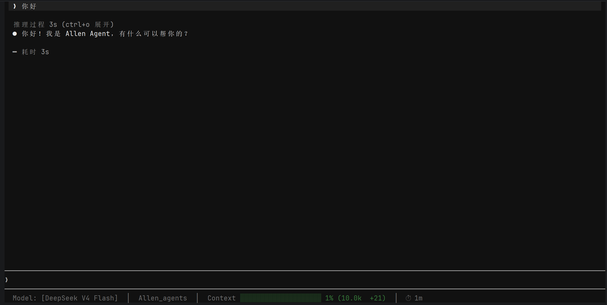

<div align="center">
  <h1>🤖 Allen Agents</h1>
  <p><strong>RAG + Agent (ReAct) + 多引擎搜索 — 智能问答系统</strong></p>
  <p>Python 3.11+ | 中文优先 | 流式输出 | TUI 交互</p>
</div>

---

## 📸 界面预览

Allen Agents 提供两种交互模式：

| 模式 | 命令 | 特点 |
|------|------|------|
| **TUI**（推荐） | `allen` 或 `python main.py --tui` | 沉浸式终端界面，支持流式输出、对话管理 |
| **CLI** | `python main.py` | 轻量终端对话 |



*TUI 模式 — 纯黑主题，流式输出，支持对话管理、思考过程展开/折叠*

---

## ✨ 功能特性

### 🧠 1. RAG 引擎
- **文档加载**：支持 `.txt`、`.md`、PDF 文档
- **文本分块**：滑动窗口分块策略
- **向量检索**：ChromaDB + 本地 Embedding（sentence-transformers）
- **相似度过滤**：按分数阈值过滤低质量结果
- **知识库预热**：首次启动自动建库

### 🤖 2. Allen Agent（ReAct 循环）
- **LLM 原生 Function Calling**：自主决策 + 多步推理
- **ReAct 循环**：Think → Act → Observe → Think → ...
- **8 个内置工具**：覆盖知识库、搜索、代码、文件、图片、PDF、Shell、记忆
- **失败自动降级**：工具出错 → LLM 自行切换策略
- **自我反思（Reflect）**：评估答案质量，追问或修正

### 🔍 3. 多引擎搜索
- **百度千帆 AI 搜索**（中文优化，免费 100 次/天）
- **Tavily**（AI 优化搜索）
- **DuckDuckGo**（免费通用）
- **语种自动分流**：中文 → 百度/DDG，英文 → Tavily/DDG
- **健康检查 + 加权轮询**：宕机自动切换
- **相似度去重**（阈值 0.92）+ 会话搜索次数限制（10 次）

### 🛡️ 4. 安全护栏（贯穿全链路）
- **输入过滤**：Prompt 注入检测
- **输出脱敏**：敏感信息过滤
- **工具权限**：分级权限控制
- **频率限制**：API 调用频率控制

### 🧩 5. 三层记忆体系
- **短期记忆**：内存滑动窗口（最近 N 轮对话）
- **中期记忆**：JSONL 持久化（对话历史）
- **长期记忆**：`Allen.md` 跨会话持久记忆（Agent 自动维护）

### 📊 6. 可观测性
- Token 使用统计
- LLM 调用追踪
- 工具调用追踪
- 费用估算

---

## 🏗️ 项目架构

```
用户输入
    │
    ▼
┌──────────────────────────────────────────────────────────┐
│                    感知层 (Perception)                     │
│       输入类型检测 · 截断清洗 · 语言检测                  │
└──────────────────────┬───────────────────────────────────┘
                       │
                       ▼
┌──────────────────────────────────────────────────────────┐
│              Allen Agent (ReAct 推理循环)                 │
│  System Prompt → LLM Function Calling → 工具决策 → 执行   │
│  Think → Act → Observe → Think → ... (最多 5 步)         │
│  ┌──────────────────────────────────────────────────┐    │
│  │  ReflectEngine（自我反思：评估答案 → 追问/修正）   │    │
│  └──────────────────────────────────────────────────┘    │
│  ┌──────────────────────────────────────────────────┐    │
│  │  安全护栏 (Guardrail)                             │    │
│  │  输入过滤 → 工具权限 → 输出脱敏                    │    │
│  └──────────────────────────────────────────────────┘    │
└───────────┬───────────┬───────────┬──────────────────────┘
            │           │           │
            ▼           ▼           ▼
    ┌───────────┐ ┌───────────┐ ┌───────────┐
    │ 知识库 Tool│ │ 搜索 Tool │ │ 其他 6 个 │
    │  (RAG)    │ │ (3引擎)   │ │  工具     │
    └─────┬─────┘ └─────┬─────┘ └─────┬─────┘
          │             │             │
          ▼             ▼             ▼
    ┌───────────┐ ┌───────────┐ ┌───────────┐
    │ ChromaDB  │ │ Baidu     │ │ File      │
    │ Embedding │ │ Tavily    │ │ Image     │
    │           │ │ DuckDuckGo│ │ PDF       │
    │           │ │           │ │ Shell     │
    │           │ │           │ │ Code Search│
    │           │ │           │ │ Memory    │
    └───────────┘ └───────────┘ └───────────┘
            │             │
            ▼             ▼
    ┌──────────────────────────────────────┐
    │         三层记忆系统                   │
    │  短期(内存) → 中期(JSONL) → 长期(MD)  │
    └──────────────────────────────────────┘
```

## 📂 目录结构

```
Allen_agents/
├── main.py                 # 入口：create_agent() 组装所有组件
├── config.py               # AppConfig 集中配置管理
├── pyproject.toml          # 项目元数据（入口：allen = "main:run_tui"）
├── models.yaml             # 模型提供商配置（含 API Key，不提交 Git）
├── .env                    # 搜索引擎 API Key（不提交 Git）
│
├── agents/                 # Agent 核心
│   ├── allen_agent.py      # ReAct 循环主逻辑（~400行）
│   ├── base.py             # Agent 基类
│   ├── react_loop.py       # 流式 ReAct 执行引擎
│   ├── system_prompt.py    # 系统提示词构建
│   ├── reflect.py          # 自我反思引擎
│   └── compression.py      # 对话上下文压缩
│
├── tools/                  # 8 个内置工具
│   ├── base.py             # BaseTool 基类 + ToolResult
│   ├── knowledge_tool.py   # 知识库检索
│   ├── search_tool.py      # 网络搜索（去重 + 限频）
│   ├── file_tool.py        # 文件读写
│   ├── image_tool.py       # 图片分析（OCR + 描述）
│   ├── pdf_tool.py         # PDF 解析
│   ├── shell_tool.py       # Shell 命令执行
│   ├── search_code_tool.py # 代码搜索
│   └── memory_tool.py      # 长期记忆更新
│
├── services/               # 核心服务
│   ├── rag/
│   │   ├── engine.py       # RAGEngine（检索 + 生成）
│   │   └── document.py     # 文档处理（加载 + 分块）
│   └── search/
│       ├── router.py       # 搜索路由（语种分流 + 健康检查）
│       ├── engines.py      # 搜索引擎实现
│       └── health.py       # 健康检查
│
├── infrastructure/         # 基础设施
│   ├── llm_provider.py     # 统一 LLM 客户端（OpenAI/Anthropic 双协议）
│   ├── model_manager.py    # 模型管理器（运行时切换）
│   ├── embedding.py        # Embedding 模型（sentence-transformers）
│   └── vector_store.py     # ChromaDB 向量存储
│
├── memory/                 # 三层记忆
│   ├── short_term.py       # 短期记忆（滑动窗口）
│   ├── conversation_store.py # 中期记忆（JSONL 持久化）
│   └── long_term.py        # 长期记忆（Allen.md）
│
├── guardrails/             # 安全护栏
│   ├── guardrail.py        # 统一入口
│   ├── input_filter.py     # 输入过滤（Prompt 注入检测）
│   ├── output_filter.py    # 输出脱敏
│   └── tool_policy.py      # 工具权限分级
│
├── perception/             # 感知层
│   ├── router.py           # 输入类型路由
│   └── text_handler.py     # 文本处理（截断、清洗）
│
├── frontends/              # 交互前端
│   ├── cli/                # CLI 终端模式
│   │   └── app.py
│   ├── tui/                # TUI 图形界面（Textual）
│   │   ├── app.py          # AllenApp 主应用
│   │   ├── styles.css      # 样式
│   │   ├── screens/        # 聊天屏幕
│   │   │   ├── chat.py
│   │   │   ├── chat_state.py
│   │   │   └── stream_handler.py
│   │   └── widgets/        # 界面组件
│   │       ├── header.py, input_bar.py, status_bar.py
│   │       ├── chat_panel.py, messages.py
│   │       ├── thought_block.py, thinking_widget.py
│   │       ├── tool_call.py, confirm_widget.py
│   │       ├── history_selector.py
│   │       ├── compressing_widget.py, artifact.py
│   │       └── ...
│   └── shared/
│       ├── commands.py     # 命令注册表
│       └── state.py        # 共享状态
│
├── schemas/                # 数据类
│   ├── stream.py           # StreamEvent（流式事件）
│   ├── tool.py             # ToolResult
│   ├── search.py           # SearchResult
│   ├── trace.py            # TraceEvent
│   └── context.py          # 上下文消息
│
├── observability/          # 可观测性
│   └── tracer.py           # Tracer（追踪 + 费用估算）
│
├── docs/                   # 文档
│   └── TUI页面.png         # TUI 界面截图
│
├── Rag_local_docs/         # RAG 知识库文档（可选提交）
│   ├── agent/
│   ├── deepseek/
│   └── rag/
│
├── conversations/          # 对话历史 JSONL（不提交 Git）
│
└── Vector_library/         # 向量数据库缓存（不提交 Git）
```

---

## 🚀 快速开始

### 安装

```bash
# 1. 克隆仓库
git clone https://github.com/your-username/Allen_agents.git
cd Allen_agents

# 2. 安装依赖
pip install -e .
```

### 配置

```bash
# 1. 模型配置（必须）
# 复制 models.yaml.example 为 models.yaml，填入 API Key
cp models.yaml.example models.yaml

# 2. 搜索引擎 Key（可选）
# 编辑 .env 文件，填入：
#   BAIDU_API_KEY=your_key    # 百度搜索
#   TAVILY_API_KEY=your_key   # Tavily 搜索
```

### 运行

```bash
# TUI 模式（推荐）
allen
# 或
python main.py --tui

# CLI 模式
python main.py
```

### TUI 快捷键

| 快捷键 | 功能 |
|--------|------|
| `Ctrl+C` | 退出程序 |
| `Ctrl+N` | 新建对话 |
| `Ctrl+O` | 展开/折叠思考过程 |
| `/help` | 查看所有命令 |
| `/new` | 新建对话 |
| `/model` | 切换模型 |
| `/history` | 查看历史对话 |

---

## 🛠️ 工具详解

| 工具 | 描述 | 使用场景 |
|------|------|----------|
| **KnowledgeBaseTool** | RAG 知识库检索 | 从本地文档查找信息 |
| **SearchWebTool** | 多引擎网络搜索 | 实时信息查询 |
| **CodeSearchTool** | 代码搜索 | 查找项目中的代码 |
| **FileTool** | 文件读写操作 | 阅读/创建/编辑文件 |
| **ImageTool** | 图片分析 | OCR 文字识别、图片描述 |
| **PDFTool** | PDF 解析 | 提取 PDF 文档内容 |
| **ShellTool** | Shell 命令执行 | 运行终端命令 |
| **UpdateMemoryTool** | 长期记忆更新 | Agent 自主记录信息到 Allen.md |

---

## 🔧 配置参考

### 模型配置（`models.yaml`）

支持 **OpenAI 兼容协议** 和 **Anthropic 原生协议**：

```yaml
providers:
  deepseek:
    name: "DeepSeek"
    base_url: "https://api.deepseek.com"
    api_key: "${DEEPSEEK_API_KEY}"
    protocol: "openai"           # OpenAI 兼容
    models:
      deepseek-v4-flash:
        name: "DeepSeek V4 Flash"
        has_vision: true

  anthropic:
    name: "Anthropic"
    base_url: "https://api.anthropic.com"
    api_key: "${ANTHROPIC_API_KEY}"
    protocol: "anthropic"        # Anthropic 原生
    models:
      claude-sonnet-4-6:
        name: "Claude Sonnet 4.6"

default_provider: "deepseek"
default_model: "deepseek-v4-flash"
```

### 环境变量（`.env`）

```ini
# 搜索引擎
BAIDU_API_KEY=your_baidu_key
TAVILY_API_KEY=your_tavily_key

# Agent 参数（可选）
MAX_STEPS=5
MAX_TURNS=100
MAX_REFELECTIONS=2
```

---

## 🧪 在代码中使用

```python
from main import create_agent

# 创建 Agent
agent, model_manager = create_agent()

# 流式问答（推荐）
for event in agent.run_stream("什么是 RAG？"):
    if event.type == "text":
        print(event.content, end="")
    elif event.type == "tool_call":
        print(f"\n[调用工具] {event.content}")

# 同步问答
result = agent.run("什么是 RAG？")
print(result["answer"])
```

---

## 🧩 扩展：添加新工具

```python
from tools.base import BaseTool, ToolResult

class MyTool(BaseTool):
    def __init__(self):
        super().__init__(
            name="my_tool",
            description="我的自定义工具"
        )

    def execute(self, query: str, **kwargs) -> ToolResult:
        # 实现逻辑
        return ToolResult(success=True, data="结果")
```

然后在 `main.py` 的 `create_agent()` 中注册即可：

```python
agent.register_tool(MyTool())
```

---

## 🔐 安全

提交 Git 前请注意：

| 文件/目录 | 建议 |
|-----------|------|
| `models.yaml` | ❌ 含 API Key，不提交 |
| `.env` | ❌ 含 API Key，不提交 |
| `conversations/` | ❌ 对话历史，不提交 |
| `Vector_library/` | ❌ 向量数据库缓存，不提交 |
| `Allen.md` | ⚠️ 复查后决定 |
| `Rag_local_docs/` | ⚠️ 自定文档，按需提交 |

---

## 📦 技术栈

- **LLM 协议**：OpenAI 兼容协议 + Anthropic 原生协议
- **向量数据库**：ChromaDB
- **Embedding**：sentence-transformers
- **前端**：Textual（TUI）、Rich（CLI）
- **搜索引擎**：百度千帆、Tavily、DuckDuckGo
- **OCR**：Pytesseract + Pillow

---

## 📄 License

MIT
